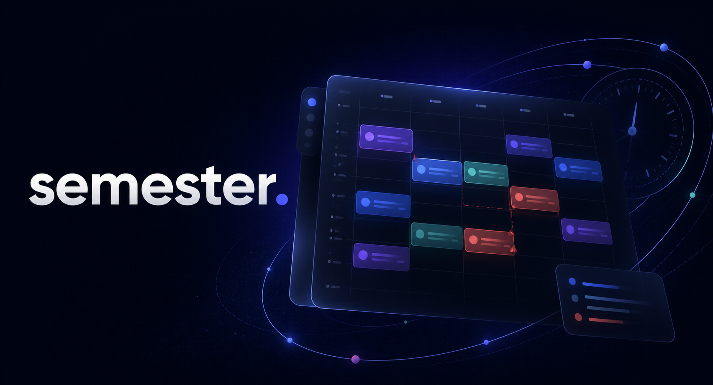
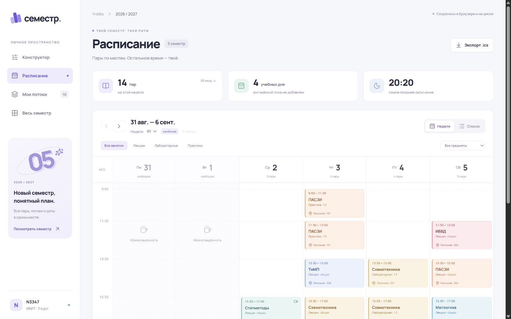

<h1 align="center">semester.</h1>

<p align="center">
  Персональный конструктор расписания с выбором потоков<br>
  и проверкой пересечений прямо в календаре.
</p>

<p align="center">
  
  
  
</p>

Собирай личное расписание из доступных потоков, примеряй изменения в черновике
и сохраняй готовый вариант только тогда, когда всё сходится.

## Возможности

| Расписание | Конструктор |
| --- | --- |
| Недельная сетка и компактный список | Выбор и добавление потоков |
| Точные даты и учебные недели | Мгновенный предпросмотр изменений |
| Фильтры по предметам и типам занятий | Красная подсветка пересечений |
| Экспорт календаря в `.ics` | Черновик отдельно от основной версии |

## Интерфейс



## Запуск

```bash
npm install
npm run dev
```

Приложение откроется на
[http://127.0.0.1:5173](http://127.0.0.1:5173).

<details>
<summary>Команды разработки</summary>

```bash
npm test
npm run build
npm run format
```

</details>

## Данные

Профиль, выбранные потоки и снимки расписания сохраняются локально. Приложение
не получает пароль от ITMO.ID и не выполняет запись на потоки в ИСУ.

## Публикация

Frontend публикуется workflow-файлом GitHub Pages. Открытые запросы к ИСУ и
расписанию обслуживает Node.js API, размещённый на Amvera.

1. Подключи репозиторий к Amvera и запусти `npm run start:api`.
2. В GitHub создай Actions variable `VITE_API_BASE_URL` с адресом API.
3. В настройках Pages выбери источник **GitHub Actions** и запусти workflow.

У каждого посетителя будет отдельный профиль в его браузере. Общей базы
студентов и паролей в проекте нет.

---

<p align="center">
  Независимый студенческий проект.<br>
  Не является официальным сервисом Университета ИТМО.
</p>
